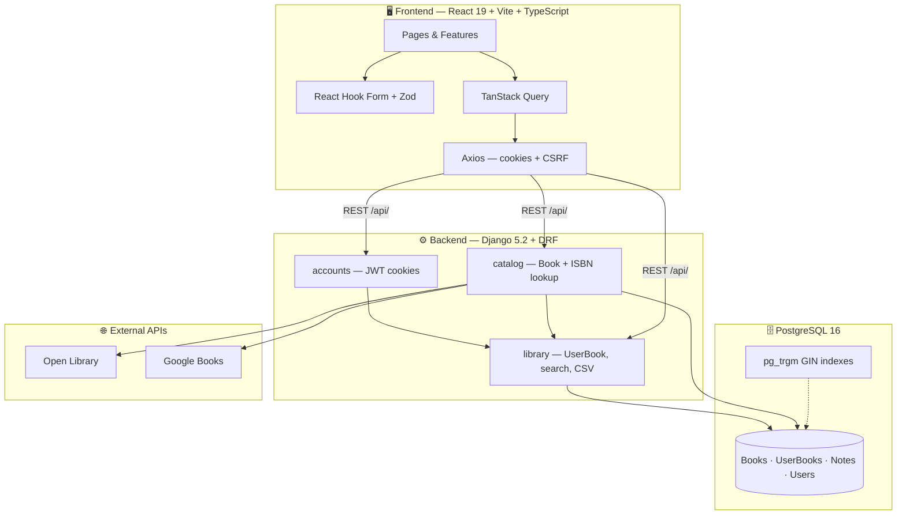
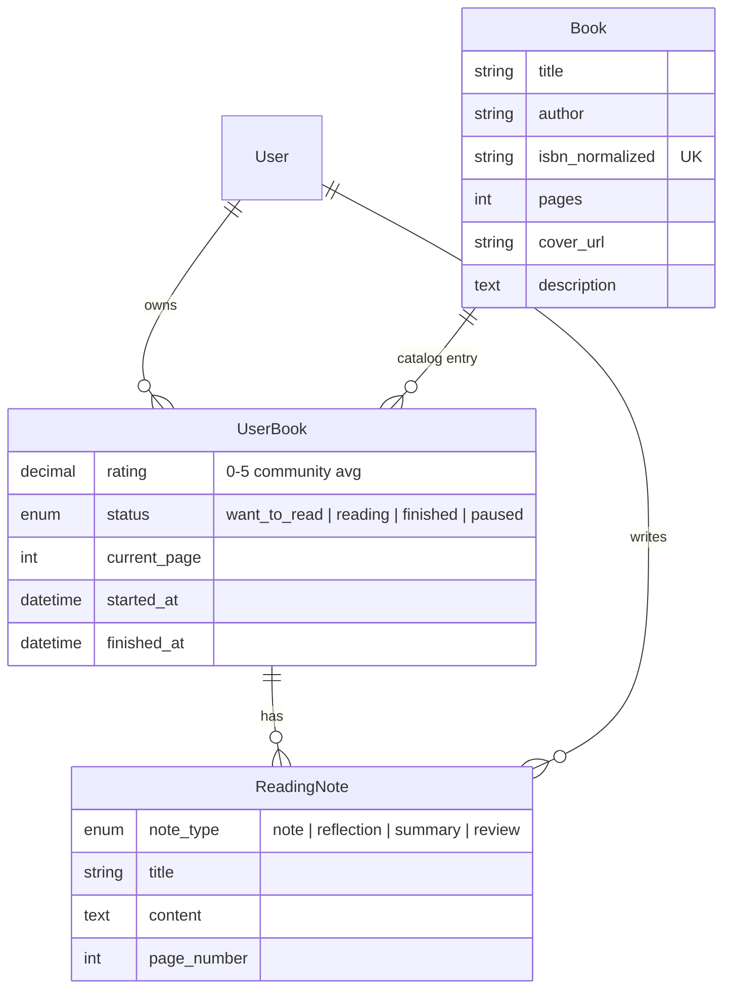

<div align="center">

# 📚 Book Tracker

**A full-stack personal reading tracker — built for scale, validated end-to-end, and ready to deploy locally.**

[](https://react.dev/)
[](https://www.typescriptlang.org/)
[](https://www.djangoproject.com/)
[](https://www.postgresql.org/)
[](#-testing)

*React + TypeScript frontend · Django REST API · PostgreSQL · Docker Compose*

[Quick Start](#-quick-start) · [Features](#-features) · [Architecture](#-architecture) · [Scaling](#-scaling-to-10m-records) · [Testing](#-testing) · [AI Usage](#-ai-usage--verification)

</div>

---

## 📋 Table of contents

- [About the project](#-about-the-project)
- [Recruitment task — requirements mapping](#-recruitment-task--requirements-mapping)
- [Quick start](#-quick-start)
- [Features](#-features)
- [Architecture](#-architecture)
- [Tech stack](#-tech-stack)
- [Data model](#-data-model)
- [Scaling to ~10M records](#-scaling-to-10m-records)
- [Validation & error handling](#-validation--error-handling)
- [Authentication](#-authentication)
- [API overview](#-api-overview)
- [Testing](#-testing)
- [Project structure](#-project-structure)
- [Deployment (Vercel + Railway)](#-deployment-vercel--railway)
- [Loose ends & future work](#-loose-ends--future-work)
- [AI usage & verification](#-ai-usage--verification)
- [Further reading](#-further-reading)

---

## 🎯 About the project

**Book Tracker** is a full-stack web application that lets users build a private library of books they read (or plan to read), rate them, track reading progress, write notes, search their collection, and import or export data — all persisted in **PostgreSQL**, not in memory.

The UI is a modern SaaS-style dashboard with a responsive layout (mobile, tablet, laptop), light/dark theme, and polished empty/loading/error states. The backend is a REST API designed with **datasets up to ~10 million records** in mind: keyset pagination, targeted indexes, and PostgreSQL trigram search.

> **Demo account:** after seeding, click **"Try the demo account"** on the login screen — `demo` / `DemoPassword123!`

---

## ✅ Recruitment task — requirements mapping

The original brief asked for a book-tracking app within an **8-hour** scope. Below is an honest mapping of what was requested vs. what was delivered.

| # | Requirement | Status | Implementation |
|---|-------------|--------|----------------|
| 1 | **Add a book** (title, author, ISBN, pages, 1–5 rating) in a dedicated UI | ✅ Done | `/add` — manual form with React Hook Form + Zod |
| 1 | Save in a **persistent, non in-memory** database | ✅ Done | PostgreSQL 16 via Docker Compose |
| 1 | **Validate data** and show error messages | ✅ Done | Zod (client) + DRF serializers (server); inline field errors + API error toasts |
| 2 | **List books** in a dedicated UI | ✅ Done | `/library` — grid, filters, sort, cursor pagination |
| 3 | Designed for **up to 10M records** | ✅ Done | Keyset pagination, composite + GIN indexes — [details](#-scaling-to-10m-records) |
| 4 | **Bonus: search** on title & author | ✅ Done | Debounced live search; ISBN-aware; `pg_trgm` ranking on backend |
| — | React + TypeScript frontend | ✅ Done | React 19, Vite 8, TypeScript 6 |
| — | Backend technology of choice | ✅ Done | Django 5.2 + DRF + PostgreSQL |
| — | Automated tests (plus) | ✅ Done | **161 tests** — pytest, Vitest, Playwright E2E |
| — | Comment on loose ends | ✅ Done | [Loose ends section](#-loose-ends--future-work) |

**Scope beyond the brief** (time-boxed extras that demonstrate product thinking):

- 📊 Dashboard with reading stats and a "currently reading" shelf
- 🔍 ISBN metadata lookup (Open Library + Google Books fallback)
- 📥 CSV import with **client-side preview** + ISBN-only CSV import
- 📤 Library export (CSV / JSON)
- 📝 Private notes per book (note / reflection / summary / review)
- 🌓 Light / dark theme
- 🔐 Cookie-based JWT auth + optional Google Sign-In
- 📱 Responsive layout across phone, tablet, and desktop

---

## 🚀 Quick start

**Prerequisites:** [Docker Desktop](https://www.docker.com/products/docker-desktop/), [Node.js 20+](https://nodejs.org/)

```bash
# 1️⃣  Backend + database
cd book-tracker-backend
cp .env.example .env          # optional — compose has sane defaults
docker compose up -d --build
docker compose exec backend python manage.py migrate
docker compose exec backend python manage.py seed_demo_data

# 2️⃣  Frontend
cd ../book-tracker-frontend
cp .env.example .env          # optional
npm install
npm run dev
```

Open **http://localhost:5173** and click **Try the demo account**.

| Service | URL |
|---------|-----|
| 🖥️ Frontend | http://localhost:5173 |
| 🔌 API | http://localhost:8000/api/ |
| 📖 Swagger UI | http://localhost:8000/api/docs/ |
| 💚 Health check | http://localhost:8000/api/health/ |

<details>
<summary><strong>🧪 Run all tests</strong></summary>

```bash
# Backend (87 tests)
cd book-tracker-backend
docker compose exec backend pytest
docker compose exec backend ruff check .

# Frontend unit (24 tests)
cd book-tracker-frontend
npx vitest run --exclude "e2e/**"

# E2E — Playwright (50 tests, chromium + mobile)
npm run test:e2e

# Production build
npm run build
```

</details>

---

## ✨ Features

### 🔐 Authentication
- Sign in / sign up with username, email, and password
- **httpOnly JWT cookies** — tokens never exposed to JavaScript
- CSRF double-submit protection on unsafe requests
- One-click **demo account** for reviewers
- Optional **Google Sign-In** (hidden when client ID is unset)

### 🏠 Dashboard (`/`)
- Summary cards: total books, currently reading, finished, average rating, pages read
- **Currently reading** shelf — progress bars, +10 pages, set page, mark finished
- **Recently added** list with cursor pagination
- Global search bar with instant results (title, author, ISBN)

### 📚 Library (`/library`)
- Responsive book grid with covers, status badges, ratings, and progress
- **Live search** (300 ms debounce; min 2 chars, or instant for ISBN-like input)
- Filters: status, rating (including **unrated**), sort (relevance / newest / rating / progress / pages)
- **Cursor pagination** — stable performance at any library size
- **Export** entire library as CSV or JSON
- Remove books with confirmation

### ➕ Add book (`/add`)
Four workflows in one screen:

| Tab | Description |
|-----|-------------|
| **Add manually** | Full form: title, author, ISBN, pages, rating, status, current page |
| **Find by ISBN** | Looks up metadata via Open Library (+ Google Books fallback), prefills the form |
| **Import by ISBN** | Upload a CSV of ISBNs → preview → bulk lookup → add to library |
| **Import CSV** | Full CSV import with **preview table**, row-level validation, and post-import error summary |

### 📖 Book details (`/books/:id`)
- Cover, metadata, reading status, and progress
- Editable rating (0–5, half-star steps)
- **Notes & reflections** — create, edit, delete private notes (typed: note / reflection / summary / review)

### 🎨 UX polish
- Light / dark theme with system-aware defaults
- Loading skeletons, empty states, and inline error messages throughout
- Collapsible sidebar; layout adapts from **mobile → tablet → desktop**
- View transitions between list and detail views

---

## 🏗 Architecture



### Request flow (authenticated)

1. Browser loads SPA → fetches CSRF cookie → checks `GET /auth/me/`
2. TanStack Query manages server state (cache, stale-while-revalidate, `keepPreviousData` on search)
3. Unsafe methods (`POST`, `PATCH`, `DELETE`) attach `X-CSRFToken` from the `csrftoken` cookie
4. Backend validates via DRF serializers; library queries use indexed search + keyset pagination
5. Errors surface as field-level messages (forms) or toast/banner messages (API failures)

### Design principles

| Principle | Choice |
|-----------|--------|
| **Separation of catalog vs. user state** | Shared `Book` row per ISBN; per-user `UserBook` for rating, status, progress |
| **Single source of validation truth** | Backend serializers; frontend Zod mirrors rules for instant feedback |
| **Scale-first listing** | Never `OFFSET`; always cursor pagination on `(created_at, id)` |
| **Search without full scans** | `pg_trgm` GIN indexes + ISBN B-tree; relevance ranking in SQL |
| **Security by default** | httpOnly cookies, CSRF on mutations, auth required on all library endpoints |

---

## 🛠 Tech stack

### Frontend (`book-tracker-frontend/`)

| Layer | Technology |
|-------|------------|
| Framework | React 19, TypeScript 6, Vite 8 |
| Styling | Tailwind CSS v4 (`@tailwindcss/vite`, CSS-first config) |
| Routing | React Router v7 |
| Server state | TanStack Query v5 |
| Forms | React Hook Form + Zod v4 |
| HTTP | Axios (credentials + CSRF interceptor) |
| Icons | Lucide React |
| Unit tests | Vitest + Testing Library + jsdom |
| E2E tests | Playwright (Chromium + Pixel 7 mobile) |

### Backend (`book-tracker-backend/`)

| Layer | Technology |
|-------|------------|
| Framework | Django 5.2 (LTS), Django REST Framework |
| Database | PostgreSQL 16 + `pg_trgm` extension |
| Auth | SimpleJWT (httpOnly cookie delivery) + Django CSRF |
| API docs | drf-spectacular → OpenAPI 3 + Swagger UI |
| ISBN | Custom validation (ISBN-10/13 checksum) + normalization |
| Metadata | Open Library API + Google Books API (fallback) |
| Tooling | pytest, pytest-django, ruff |
| Runtime | Docker Compose (Postgres + backend dev server) |

---

## 🗃 Data model



**Why this shape?**

- **`Book`** — shared catalog metadata, one row per edition (keyed by normalized ISBN). Two users can track the same physical book independently.
- **`UserBook`** — subjective, per-reader state: rating, status, progress. Unique on `(user, book)`.
- **`ReadingNote`** — one-to-many notes per book; privately owned, indexed for fast listing.

---

## 📈 Scaling to ~10M records

The brief asked for a design that could handle large datasets. This app **never returns all rows** and **never uses OFFSET pagination**.

### Keyset (cursor) pagination

```
GET /api/library/?cursor=<token>
ORDER BY (-created_at, -id)
INDEX:  userbook_keyset_idx (user, -created_at, -id)
```

Each page is a bounded index range scan — page 1 and page 10 000 cost the same, unlike `OFFSET` which scans and discards rows.

### Indexes

| Index | Purpose |
|-------|---------|
| `Book.isbn_normalized` (unique B-tree) | Exact / prefix ISBN lookup |
| `userbook_keyset_idx` | Default "newest" list pagination |
| `userbook_status_idx` | Filter by reading status |
| `userbook_rating_idx` | Filter by rating / unrated |
| `book_title_trgm_idx` (GIN) | Trigram-accelerated title search |
| `book_author_trgm_idx` (GIN) | Trigram-accelerated author search |

### Search strategy

| Input type | Strategy |
|------------|----------|
| ISBN-like | Prefix match on `isbn_normalized` (B-tree) |
| Free text | `ILIKE` + `pg_trgm` similarity; title weighted 2× over author |
| Ranking priority | ISBN exact → title → author → description |

### Honest caveat

Sorts by rating, progress, or relevance keyset on lower-cardinality or computed fields — acceptable at recruitment scale, but a production system at extreme depth would push ranked search into a dedicated engine (OpenSearch, Elasticsearch). The **"newest" sort** is the properly indexed, fully scalable path.

---

## 🛡 Validation & error handling

Validation lives in **one place on the server** and is **mirrored on the client** for instant UX.

| Field | Rules |
|-------|-------|
| Title / author | Required, trimmed, max length |
| ISBN | Valid ISBN-10 or ISBN-13 (checksum verified), normalized to canonical key |
| Pages | Positive integer, sane upper bound (100 000) |
| Rating | 0–5, one decimal place (Google Books community average) |
| Current page | 0 ≤ page ≤ book.pages; marking *finished* sets page = pages + `finished_at` |
| CSV import | Same serializer as manual add — one validation path |

**Error UX:**
- Client-side: inline field errors under inputs (Zod + React Hook Form)
- Server-side: DRF validation errors mapped back to form fields or shown as alerts
- Auth failures: *"Invalid username or password."*
- Empty search: *"No books found — Try a different search or filter."*
- CSV preview: row-level flags before upload is enabled

---

## 🔒 Authentication

| Concern | Approach |
|---------|----------|
| Token storage | **httpOnly cookies** (access + refresh) — mitigates XSS token theft |
| CSRF | Double-submit: non-httpOnly `csrftoken` cookie echoed in `X-CSRFToken` header |
| Local dev | `SameSite=Lax`, `Secure=False` |
| Production (Vercel + Railway) | `SameSite=None`, `Secure=True`, HTTPS only |
| Google Sign-In | GIS ID token → `POST /auth/google/` → same cookie session |

---

## 🔌 API overview

All routes under `/api/`. Swagger UI at `/api/docs/`.

<details>
<summary><strong>Auth endpoints</strong></summary>

| Method | Path | Description |
|--------|------|-------------|
| `GET` | `/auth/csrf/` | Set CSRF cookie |
| `POST` | `/auth/register/` | Create account |
| `POST` | `/auth/login/` | Sign in |
| `POST` | `/auth/logout/` | Sign out |
| `GET` | `/auth/me/` | Current user |
| `POST` | `/auth/refresh/` | Refresh access token |
| `POST` | `/auth/google/` | Google ID token exchange |

</details>

<details>
<summary><strong>Library endpoints</strong></summary>

| Method | Path | Description |
|--------|------|-------------|
| `GET` | `/library/` | List (cursor pagination; `search`, `status`, `rating`, `sort`) |
| `POST` | `/library/` | Add book manually |
| `GET` | `/library/export/?export_as=csv\|json` | Download library |
| `GET/PATCH/DELETE` | `/library/{id}/` | Detail / update / remove |
| `POST` | `/library/import-csv/` | Bulk CSV import |
| `GET/POST` | `/library/{id}/notes/` | List / create notes |
| `GET/PATCH/DELETE` | `/notes/{id}/` | Note CRUD |
| `GET` | `/dashboard/` | Stats + currently-reading shelf |

</details>

<details>
<summary><strong>Catalog endpoints</strong></summary>

| Method | Path | Description |
|--------|------|-------------|
| `GET` | `/books/lookup-isbn/?isbn=…` | Open Library + Google Books metadata |
| `GET` | `/health/` | Health check |

</details>

---

## 🧪 Testing

| Suite | Count | Tool | Scope |
|-------|-------|------|-------|
| Backend integration | **87** | pytest | Auth, library CRUD, search, CSV, export, ISBN, notes, dashboard, models |
| Frontend unit | **24** | Vitest | Zod schemas, CSV/ISBN preview parsers, API client, hooks, forms |
| End-to-end | **50** | Playwright | Auth, add/validate, library filters, export, CSV preview, ISBN import, dashboard, mobile |
| **Total** | **161** | | |

**E2E coverage highlights:**
- Invalid credentials → error message
- Client-side ISBN validation
- Duplicate ISBN rejection
- CSV preview before import; missing-column error
- Library export (CSV + JSON download)
- Theme toggle (light ↔ dark)
- Dashboard stat drill-down to filtered library
- Real ISBN CSV import (5 books, Open Library lookup)

**Quality gates also run:** `ruff check` (backend), `npm run build` (TypeScript + Vite production bundle), manual browser walkthrough of all major flows.

---

## 📁 Project structure

```
rekrutacja/
├── book-tracker-backend/          # Django REST API
│   ├── config/                    # Settings, URLs, WSGI
│   ├── apps/
│   │   ├── accounts/              # Auth, cookies, CSRF, Google OAuth
│   │   ├── catalog/               # Book model, ISBN utils, external lookup
│   │   └── library/               # UserBook, notes, search, CSV, export, dashboard
│   ├── scripts/start.sh           # Railway: migrate → seed → gunicorn
│   ├── railway.toml               # Railway deploy config
│   ├── tests/                     # pytest suite (13 modules)
│   └── docker-compose.yml         # Postgres + backend (local dev)
│
├── book-tracker-frontend/         # React SPA
│   ├── src/
│   │   ├── features/              # auth, library, addBook, dashboard, notes
│   │   ├── pages/                 # Dashboard, Library, AddBook, BookDetails
│   │   ├── components/            # UI kit, layout, book cover
│   │   └── lib/                   # API client, schemas, theme
│   ├── e2e/                       # Playwright specs (10 files)
│   ├── test-data/                 # CSV samples (mirrors root test-data/)
│   └── vercel.json                # Vercel SPA rewrites + build
│
├── test-data/                     # 📎 Sample CSVs for recruiter manual testing
│   ├── README.md
│   ├── books-import-test.csv      # Full CSV import (5 books)
│   └── isbn-import-5-books.csv    # ISBN-only import (5 books)
│
└── README.md                      # ← you are here
```

---

## 🚢 Deployment (Vercel + Railway)

The repo includes **production-ready deploy configs**. After deploy you get the same **demo account** and **30 curated books** as local `seed_demo_data` — no manual setup.

### ✅ Deploy readiness checklist

| Item | Status | Notes |
|------|--------|-------|
| Frontend build (`npm run build`) | ✅ | TypeScript + Vite; `vercel.json` included |
| Backend WSGI (gunicorn) | ✅ | `scripts/start.sh` — not `runserver` |
| PostgreSQL (persistent) | ✅ | Railway Postgres plugin → `DATABASE_URL` |
| Auto-migrate on deploy | ✅ | `migrate --noinput` in start script |
| Auto-seed demo data | ✅ | `seed_demo_data` runs on every deploy (idempotent) |
| Cookie auth (cross-site) | ✅ | Set `AUTH_COOKIE_SECURE=True`, `SAMESITE=None` |
| CORS / CSRF for Vercel | ✅ | Set origins to your Vercel URL |
| Health check | ✅ | `GET /api/health/` (Railway healthcheck in `railway.toml`) |
| Sample CSV files in repo | ✅ | [`test-data/`](test-data/) for recruiter testing |

### 🎁 What you get after deploy

Every Railway deploy automatically runs:

```bash
python manage.py migrate --noinput
python manage.py seed_demo_data
gunicorn config.wsgi:application ...
```

This creates / refreshes:

| | Value |
|---|--------|
| **Demo login** | `demo` / `DemoPassword123!` (or **Try the demo account** button) |
| **Library** | **30 curated books** — fantasy, sci-fi, classics, programming (real ISBNs, covers, mixed statuses, ratings, progress, sample notes) |

> Locally you may see extra books from E2E test runs. Production always starts from the clean 30-book demo fixture.

---

### Step 1 — Railway (backend + Postgres)

1. Create a **Railway** project → **New → Database → PostgreSQL**.
2. **New → GitHub Repo** → select this repo → set **Root Directory** to `book-tracker-backend`.
3. Link the Postgres service (Railway injects `DATABASE_URL` automatically).
4. Set **Variables** on the backend service:

| Variable | Value |
|----------|-------|
| `DJANGO_SECRET_KEY` | long random string |
| `DJANGO_DEBUG` | `False` |
| `DJANGO_ALLOWED_HOSTS` | `your-app.up.railway.app` |
| `CORS_ALLOWED_ORIGINS` | `https://your-app.vercel.app` |
| `CSRF_TRUSTED_ORIGINS` | `https://your-app.vercel.app` |
| `AUTH_COOKIE_SECURE` | `True` |
| `AUTH_COOKIE_SAMESITE` | `None` |

5. Deploy. Railway uses [`railway.toml`](book-tracker-backend/railway.toml) → `bash scripts/start.sh`.
6. Copy the public URL (e.g. `https://your-app.up.railway.app`).

<details>
<summary><strong>Verify backend</strong></summary>

```bash
curl https://your-app.up.railway.app/api/health/
# → {"status":"ok"}
```

Swagger: `https://your-app.up.railway.app/api/docs/`

</details>

---

### Step 2 — Vercel (frontend)

1. **Import** the same GitHub repo on [Vercel](https://vercel.com).
2. Set **Root Directory** to `book-tracker-frontend`.
3. Framework preset: **Vite** (auto-detected from `vercel.json`).
4. **Environment variables** (optional):

| Variable | Value |
|----------|-------|
| `VITE_API_BASE_URL` | **Leave unset** — the app calls same-origin `/api`, proxied to Railway via [`vercel.json`](book-tracker-frontend/vercel.json). Do **not** set this to the Railway URL. |
| `VITE_GOOGLE_CLIENT_ID` | Your Google OAuth client ID (optional) |

5. Deploy → open your Vercel URL → **Try the demo account**.

> `VITE_*` vars are baked in at **build time**. Redeploy after changing them.

---

### 📎 Test CSV files (`test-data/`)

The [`test-data/`](test-data/) folder is committed to the repo so reviewers can test import flows without creating files:

| File | Use in app | What it tests |
|------|------------|---------------|
| [`books-import-test.csv`](test-data/books-import-test.csv) | **Add book → Import CSV** | 5 books with full columns; preview table + validation |
| [`isbn-import-5-books.csv`](test-data/isbn-import-5-books.csv) | **Add book → Import by ISBN** | 5 real ISBNs → Open Library lookup → bulk add |

See [`test-data/README.md`](test-data/README.md) for step-by-step instructions.

**Suggested recruiter flow after deploy:**

1. Open deployed Vercel URL → **Try the demo account**
2. Browse dashboard & library (30 seeded books)
3. **Add book → Import by ISBN** → upload `test-data/isbn-import-5-books.csv`
4. **Add book → Import CSV** → upload `test-data/books-import-test.csv`
5. Search for *Dune*, open a book, add a note

---

### Local vs production

| | Local (Docker) | Production |
|---|----------------|------------|
| Frontend | `npm run dev` :5173 | Vercel static + SPA rewrites |
| Backend | `runserver` :8000 | gunicorn via Railway |
| Database | Docker Postgres | Railway Postgres |
| Demo seed | `docker compose exec backend python manage.py seed_demo_data` | Automatic on every deploy |

---

## 🔧 Loose ends & future work

This is **not** a production-hardened system — intentionally scoped to an 8-hour recruitment task. Known gaps and pragmatic next steps:

| Area | Current state | Production path |
|------|---------------|-----------------|
| **Rate limiting** | None | Throttle auth + ISBN lookup endpoints (DRF throttling / Redis) |
| **ISBN lookup cache** | Live API call every time | Redis cache with TTL; reduces latency and quota usage |
| **Large CSV uploads** | Synchronous; preview is client-side | Background job queue (Celery + Redis) for 10k+ row files |
| **Refresh token rotation** | Basic refresh cookie | Rotation + blacklist app (SimpleJWT) |
| **Search at extreme scale** | Postgres trigram | Dedicated search engine (OpenSearch) for global catalog |
| **CI/CD** | Manual test runs | GitHub Actions: pytest → vitest → playwright → deploy |
| **Monitoring** | Django logs only | Structured logging + Sentry / Datadog |
| **OAuth hardening** | Google only, no linking UI | Account linking, nonce checks, more providers |
| **Vitest config** | `npm test` picks up `e2e/` files | Add `exclude: ['e2e/**']` to `vite.config.ts` |
| **ESLint** | 3 `react-refresh` warnings | Split hooks/utils from component files |

### 💡 Product ideas for future versions

Natural next steps that build on the existing catalog lookup, reading progress, and notes infrastructure:

| Feature | Idea | How it could work |
|---------|------|-------------------|
| 📖 **Richer book metadata** | Full descriptions and **categories/genres** from external APIs | Extend the Open Library / Google Books merge to persist `description`, subjects, and categories on `Book`; show them on the details page and allow filtering the library by genre |
| 📅 **Reading calendar** | Visual timeline of reading activity | Track `started_at` / `finished_at` and daily page updates; render a calendar heatmap (GitHub-style) or month view showing which days you read and how many pages |
| 🗓️ **Reading planner** | Plan *what* to read and *when* | Let users set target finish dates, daily page goals, and a ordered reading queue; dashboard widget shows “read X pages today to stay on track” based on `(pages − current_page) / days left` |
| 📸 **Add book by ISBN photo** | Snap a photo of the back cover → book added automatically | Mobile camera upload → OCR (e.g. Tesseract, Google Cloud Vision, or AWS Textract) to extract ISBN barcode/text → existing `lookup-isbn` pipeline → prefilled add form or one-tap confirm; fallback to manual crop/retake if OCR confidence is low |

These were out of scope for the 8-hour task but fit cleanly into the current architecture: metadata lands on `Book`, planner/calendar reads from `UserBook` timestamps and `current_page`, and photo-import reuses the ISBN lookup endpoint already in place.

---

## 🤖 AI usage & verification

AI coding assistants (Cursor) were used as a **pair-programming tool**, not as an autonomous author. All generated output was **read, adapted, and verified** before being kept. Below is an honest breakdown.

### Where AI helped

| Area | How AI was used |
|------|-----------------|
| 🎨 **UI styling & responsiveness** | Layout structure, Tailwind utility patterns, spacing/typography tokens, and responsive breakpoints for **mobile, tablet, and laptop** views — sidebar collapse, grid columns, touch-friendly controls. I reviewed every screen size in the browser and adjusted manually where needed. |
| 🌐 **Open Library / Google Books integration** | HTTP client setup, response field mapping, cover URL normalization, and fallback logic when one source lacks pages or cover art. Cross-checked against [Open Library API docs](https://openlibrary.org/dev/docs/api) and Google Books API reference. |
| 🧪 **Test scaffolding** | pytest fixtures, Playwright helper functions, and Vitest cases for CSV/ISBN preview parsers. Test *intent* and assertions were reviewed; flaky selectors were fixed manually. |
| 📐 **Architecture boilerplate** | Initial Django app layout, DRF serializer/view patterns, Axios CSRF interceptor, and TanStack Query hook structure — then refactored to match project conventions. |
| 🐳 **Docker Compose setup** | Service definitions, env wiring, and migration/seed commands in README snippets. |
| 📝 **Documentation drafts** | First passes of README sections and inline docstrings; rewritten for accuracy after code review. |
| 🐛 **Debugging** | CSRF cookie timing, CORS + credentials in dev, and Playwright race conditions during page transitions. |

### How output was verified

| Check | Result |
|-------|--------|
| `pytest` (backend) | ✅ 87 / 87 passing |
| `vitest run --exclude e2e/**` | ✅ 24 / 24 passing |
| `playwright test` (chromium + mobile) | ✅ 50 / 50 passing |
| `ruff check .` | ✅ clean |
| `npm run build` | ✅ TypeScript + Vite production bundle |
| **Manual browser testing** | All flows: auth, dashboard, search, add/validate, ISBN lookup, CSV preview, export, notes, theme toggle, error states |
| **Swagger UI** | Endpoint contracts match frontend API calls |
| **Official documentation** | Django 5.2, Tailwind v4 CSS-first setup, SimpleJWT cookie pattern, `pg_trgm` indexing |

> AI accelerated repetitive work (styling patterns, test boilerplate, API wiring). **Architectural decisions** — normalized Book/UserBook split, keyset pagination, trigram search, cookie auth — were made deliberately and are reflected in the code and tests.


<div align="center">

**Built as a recruitment task submission — prioritising structure, reasoning, and verifiable quality over checkbox completeness.**

⭐ *If you're reviewing this: start the demo account, search for "Dune", open a book, add a note, and try the ISBN lookup tab.*

</div>
